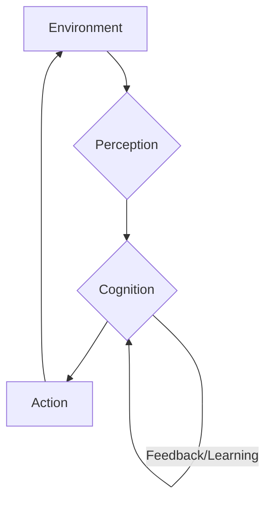

# Chapter 1: Introduction to Physical AI - Diagrams / Illustrations

## Conceptual Diagram: Perception → Cognition → Action

This diagram illustrates the fundamental closed-loop architecture of a Physical AI system, highlighting how it interacts with its environment.

**Description:**

1.  **Environment:** Represents the physical world where the robot operates, including objects, terrains, and other agents.
2.  **Perception:** The process by which the Physical AI system gathers information from the environment using various sensors (e.g., cameras, LiDAR, tactile sensors, microphones). This involves raw data acquisition, filtering, and processing to extract meaningful features and understand the current state of the environment and the robot itself (proprioception).
3.  **Cognition:** The "thinking" component where the perceived information is processed. This involves:
    *   **World Modeling:** Building an internal representation of the environment.
    *   **Reasoning:** Interpreting sensory data, predicting future states, and understanding context.
    *   **Planning:** Generating high-level strategies and specific action sequences to achieve goals.
    *   **Learning:** Adapting behaviors, improving performance, and acquiring new skills based on experience and feedback.
4.  **Action:** The execution component where the Physical AI system physically interacts with the environment through its actuators (e.g., motors, grippers, hydraulic systems). This involves translating cognitive plans into low-level motor commands to perform tasks such as locomotion, manipulation, communication, or interaction.
5.  **Feedback/Learning (from Cognition to Cognition):** The continuous loop where the outcomes of actions and new perceptions are used to refine cognitive models, plans, and learning algorithms, allowing the AI to adapt and improve over time.

This diagram emphasizes the continuous and interdependent cycle of sensing, thinking, and acting that defines an intelligent physical agent. The success of Physical AI hinges on the seamless integration and robustness of each of these stages, enabling the system to operate autonomously and intelligently in the real world.
