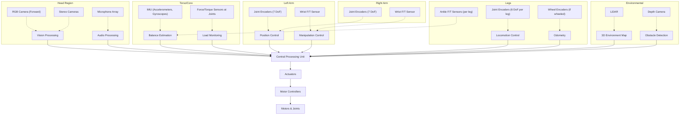

# Chapter 3: Sensors and Actuators - Diagrams / Illustrations

## Sensor Placement on Humanoid Robot

This diagram illustrates typical sensor locations on a humanoid robot and what each sensor perceives.



**Description:**

1. **Head**: Cameras and microphones provide visual and auditory perception for object recognition, face detection, and natural language interaction.

2. **Torso**: IMU provides internal state for balance control. Joint torque sensors detect external forces and load.

3. **Arms**: Joint encoders (one per degree of freedom) provide precise arm positioning. Wrist sensors measure manipulation forces.

4. **Legs**: Extensive joint sensing enables sophisticated gait control. Ankle force sensors are critical for balance maintenance.

5. **Environment**: LiDAR and depth cameras create a 3D map of surroundings for navigation and obstacle avoidance.

6. **Central Processing**: All sensor data feeds to the CPU where sensor fusion, filtering, and decision-making occurs.

7. **Closed Loop**: Decisions flow back to motor controllers, creating closed-loop control.

---

## Sensor-Actuator Feedback Loop

This diagram shows the fundamental control loop integrating sensors and actuators.

```
┌─────────────────────────────────────────────────────────────┐
│                    HUMANOID ROBOT CONTROL                   │
└─────────────────────────────────────────────────────────────┘

        ┌────────────────────────────────────┐
        │     SENSING (Proprioceptive)       │
        │                                    │
        │  • Joint Encoders                  │
        │  • Force/Torque Sensors            │
        │  • IMU                             │
        │  • Motor Current Sensors           │
        └────────────────────────────────────┘
                      ↓
                [Sensor Fusion]
                      ↓
        ┌────────────────────────────────────┐
        │   STATE ESTIMATION                 │
        │                                    │
        │  • Robot Pose (position & orientation)
        │  • Joint Angles & Velocities       │
        │  • External Forces                 │
        │  • Contact Information             │
        └────────────────────────────────────┘
                      ↓
        ┌────────────────────────────────────┐
        │   CONTROL DECISION MAKING          │
        │                                    │
        │  • Trajectory Planning             │
        │  • Force Control                   │
        │  • Balance Control                 │
        │  • Task Execution                  │
        └────────────────────────────────────┘
                      ↓
        ┌────────────────────────────────────┐
        │     COMMAND GENERATION             │
        │                                    │
        │  • Target Joint Angles             │
        │  • Target Torques/Forces           │
        │  • Gripper Commands                │
        └────────────────────────────────────┘
                      ↓
        ┌────────────────────────────────────┐
        │    ACTUATION (Execution)           │
        │                                    │
        │  • Motor Commands                  │
        │  • Actuator Signals (0-255)        │
        │  • Hydraulic Valve Commands        │
        └────────────────────────────────────┘
                      ↓
        ┌────────────────────────────────────┐
        │    PHYSICAL EXECUTION              │
        │                                    │
        │  • Joints Rotate                   │
        │  • Limbs Move                      │
        │  • Robot Interacts with Environment
        └────────────────────────────────────┘
                      ↓
        ┌────────────────────────────────────┐
        │   PERCEPTION (Exteroceptive)       │
        │                                    │
        │  • Cameras (RGB-D)                 │
        │  • LiDAR                           │
        │  • Tactile Sensors                 │
        │  • Audio                           │
        └────────────────────────────────────┘
                      ↓
        ┌────────────────────────────────────┐
        │  ENVIRONMENTAL STATE OBSERVATION   │
        │                                    │
        │  • Objects detected                │
        │  • Obstacles mapped                │
        │  • Human presence recognized       │
        └────────────────────────────────────┘
                      ↓
                 [LOOP BACK TO SENSING]
                 (Typically 50-1000 Hz)

Legend:
→ Information Flow
[Brackets] = Processing Steps
```

**Control Loop Characteristics:**

- **Frequency**: 100-1000 Hz for joint-level control; 10-50 Hz for task-level planning
- **Latency Budget**: Total delay from sensing to actuation should be &lt;50ms for stable control
- **Robustness**: Multiple sensors reduce impact of individual failures
- **Adaptation**: Real-time feedback enables dynamic adjustment to unexpected changes

---

## Kalman Filter for Sensor Fusion

This diagram illustrates how the Kalman Filter combines multiple sensor measurements.

```
Measurement Update Cycle (occurs at sensor frequency, e.g., 100 Hz):

    ┌─────────────────────────────────────────────────┐
    │ PREDICTION PHASE (using motion model)           │
    │                                                 │
    │ Previous State: x(t-1)                          │
    │ Motion Command: u(t)                            │
    │                                                 │
    │ Predict: x_predicted(t) = A·x(t-1) + B·u(t)    │
    │ Estimate Prediction Uncertainty                 │
    └─────────────────────────────────────────────────┘
                          ↓
    ┌─────────────────────────────────────────────────┐
    │ MEASUREMENT PHASE (sensor readings arrive)      │
    │                                                 │
    │ Sensor 1: z₁(t) = accelerometer reading         │
    │ Sensor 2: z₂(t) = gyroscope reading             │
    │ Sensor 3: z₃(t) = encoder reading               │
    │                                                 │
    │ Innovation: Δz = z_measured - x_predicted       │
    └─────────────────────────────────────────────────┘
                          ↓
    ┌─────────────────────────────────────────────────┐
    │ FUSION (Kalman Gain Calculation)                │
    │                                                 │
    │ Weight by sensor uncertainty:                   │
    │   w₁ = 1/σ₁² (high confidence → high weight)   │
    │   w₂ = 1/σ₂²                                    │
    │   w₃ = 1/σ₃²                                    │
    │                                                 │
    │ Fused Estimate: x(t) = predicted + gain·Δz      │
    │ Update Uncertainty Estimate                     │
    └─────────────────────────────────────────────────┘
                          ↓
            ┌─────────────────────────┐
            │   FUSED STATE (t)       │
            │   More accurate than    │
            │   any single sensor     │
            │   with lower uncertainty│
            └─────────────────────────┘
                          ↓
                    [Loop Back to Prediction]

Example: Fusing IMU and Encoder for Joint Angle Estimation
- IMU gives fast gyro estimate with drift
- Encoder gives slow but accurate position
- Kalman filter:
  • Trusts gyro for fast transients (< 1 second)
  • Trusts encoder for long-term accuracy (> 5 seconds)
  • Results in accurate, responsive estimate at all timescales
```

**Key Benefits:**
1. Optimal fusion weighting based on sensor characteristics
2. Uncertainty quantification (know confidence of estimate)
3. Handles missing measurements gracefully
4. Computationally efficient for real-time operation

---

## Direct Drive vs. Geared Actuators

This diagram compares performance characteristics across frequency and torque ranges.

```
              ACTUATOR PERFORMANCE COMPARISON
                         
        Torque Output vs. Frequency Response
        
              High Torque │
                          │
                          │    ▓▓▓▓▓▓▓▓▓▓
                          │    ▓ GEARED  ▓
                          │    ▓ DRIVE   ▓
                          │    ▓▓▓▓▓▓▓▓▓▓
                          │   /         (1-100 Hz)
                          │  /
                          │ /
                          │░░░░░░░░░░░░░░░░
       Moderate Torque    │░ DIRECT DRIVE░░
                          │░ (100-1000 Hz)
                          │░░░░░░░░░░░░░░░░
                          │
       Low Torque         │
                          └────────────────────
                          Low              High
                          Frequency Response

Trade-off Analysis:

DIRECT DRIVE:
+ High bandwidth (responsive to high-frequency commands)
+ Backdrivable (can be moved by external force)
+ Simple (fewer components)
+ Low friction (high efficiency)
- Low torque output
- Heavy motor required for adequate torque
- More electrical power needed

GEARED DRIVE:
+ High torque multiplication (5:1 to 100:1 ratios)
+ Lightweight (small motor for same torque)
+ Energy efficient (achieves torque with less power)
+ Handles high inertia loads well
- Limited bandwidth (&lt;100 Hz)
- Not backdrivable (gear friction prevents it)
- More mechanical friction
- More complex, more failure points

Typical Applications:
- Humanoid arm shoulder joints: 20:1 to 50:1 gear ratio (need high torque, moderate speed)
- Humanoid hip joints: 30:1 to 100:1 (large loads from body weight)
- Fingers (if articulated): 5:1 to 20:1 (lighter loads, more dexterity needed)
- Head (lightweight): Sometimes direct drive or low ratio 2:1-5:1

Performance Envelope:
                    Typical Humanoid Operation Zone
                              ↓
        Torque Output
              50 N·m  ┌────────────┐
                      │ GEARED     │
              30 N·m  │ DRIVE      │
                      │ Operating  │
              10 N·m  │ Zone       │
                      └────────────┘
                      10 Hz  50 Hz  100 Hz
                      Frequency
```

---

## Power Distribution Architecture

This diagram shows how power flows through a humanoid robot system.

```
┌──────────────────────────────────────────────────────┐
│              POWER SOURCE                            │
│  Battery Pack: 48V, 100 Ah Li-ion                   │
│  Total Energy: ~4.8 kWh                             │
│  Weight: ~25 kg                                     │
└──────────────────────────────────────────────────────┘
                      │
                      ↓
        ┌─────────────────────────────┐
        │  Battery Management System  │
        │  • Cell balancing           │
        │  • Temperature monitoring   │
        │  • State of Charge (SOC)    │
        │  • Current limiting         │
        └─────────────────────────────┘
                      │
         ┌────────────┼────────────┐
         ↓            ↓            ↓
    ┌────────┐   ┌────────┐   ┌────────┐
    │ Main   │   │ Aux    │   │ Control│
    │ Bus    │   │ Bus    │   │ Bus    │
    │ 48V    │   │ 24V    │   │ 12V    │
    └────────┘   └────────┘   └────────┘
         │            │            │
         ↓            ↓            ↓
    ┌─────────┐ ┌─────────┐ ┌─────────┐
    │ Motor   │ │ Servo   │ │ Logic   │
    │Control. │ │Control. │ │Power    │
    │ (x16)   │ │ (x2)    │ │Supply   │
    └─────────┘ └─────────┘ └─────────┘
         │            │            │
         ↓            ↓            ↓
    ┌──────────────────────────────────┐
    │  LOADS                           │
    │                                  │
    │  Left Arm Motors (7):   600W    │
    │  Right Arm Motors (7):  600W    │
    │  Left Leg Motors (6):  1200W    │
    │  Right Leg Motors (6): 1200W    │
    │  Spine Motors (3):      300W    │
    │  Head Motors (3):       100W    │
    │  Total Motor Power:    4000W    │
    │                                  │
    │  Auxiliary Systems:     500W    │
    │  Electronics:           200W    │
    │  ─────────────────────────────   │
    │  TOTAL POWER DRAW:     4700W    │
    │  (Peak burst: 6000W)             │
    │                                  │
    │  Runtime: 4.8kWh ÷ 4.7kW ≈ 1h  │
    │  (With load; idle: 4-5 hours)    │
    └──────────────────────────────────┘

Power Management Priorities:
1. Balance Control (highest - safety critical)
2. Locomotion (critical for operation)
3. Manipulation (secondary)
4. Sensing (continuous but low power)
5. Computation (continuous)

Energy Allocation Strategies:
- Idle Mode: &lt;100W (sensors + light computation)
- Navigation Mode: 1000-2000W (legs + sensors + planning)
- Manipulation Mode: 2000-3000W (arms + computation)
- Sprint Mode: 5000-6000W (dynamic movement, brief duration)

Thermal Management:
- Heat dissipation: ~1500W during continuous operation
- Cooling: Active fans on motor controllers
- Temperature sensors: Monitor critical joints
- Thermal throttling: Reduce motor power if temp > 80°C
```

